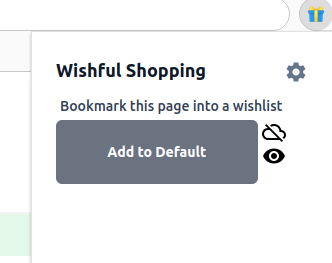
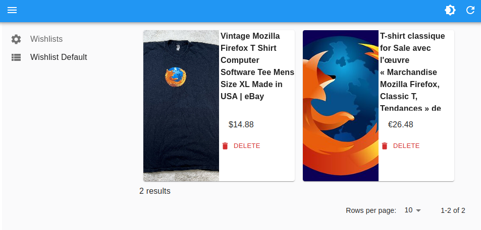
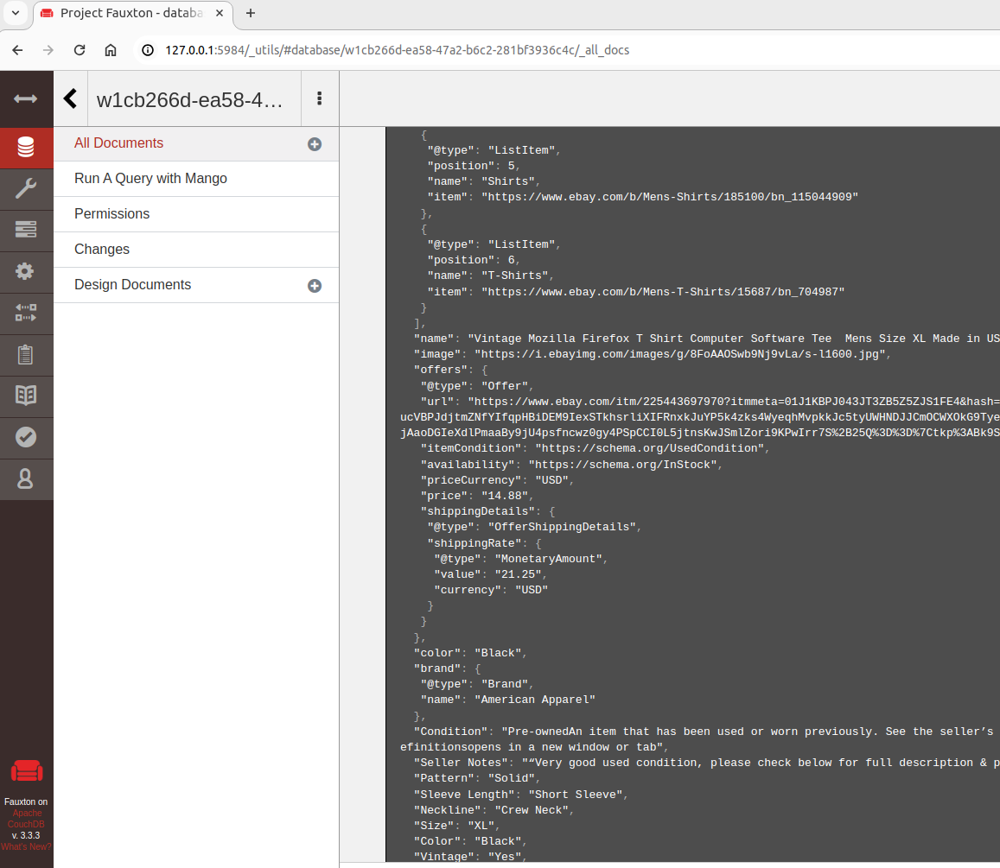

# Wishfulshopping webextension

This webextension acts as a wishlist where you can bookmark webpages and all their metadata (picture, price if any).

These data are stored into a local database, no server required.


# Scripts & Pages

- popup : button to start metadata extraction



- content : if trigger by popin button, this webextension try to extract all metadata from the current webpage visited
- options : all metadata previously extracted can be shown here. Data can be splitted into several lists (wishlists). 





# Optional sync into a couchdb database

## Self host a couchdb database

Launch an optional remote database to sync your data.

```docker run --rm --name couchdb -e COUCHDB_USER=admin -e COUCHDB_PASSWORD=password  -p 5984:5984 -v `pwd`/couchdb.ini:/opt/couchdb/etc/local.d/local.ini  -v `pwd`/couchdb:/opt/couchdb/data  couchdb```

Single Node Setup
After installation and initial startup, visit Fauxton at http://127.0.0.1:5984/_utils#setup and manage databases at http://127.0.0.1:5984/_utils/

## Import from a remote couchdb

You can supply the url such as http://127.0.0.1:5984/my-database/ of a couchdb database to be imported as a new wishlist. Data will be synchronised locally.


## Export to a remote couchdb

You can supply a url such as http://127.0.0.1:5984/my-database/ of a couchdb database alongside the other settings of an existing wishlist. The couchdb database can be automatically created and data will be synchronised with this database.

## Demo : Static website to share your lists

You must use the share url for someone to import the data in their browser, otherwise they won't see anything. You see only what is stored in your browser.


You can share your data to everyone using the share button to generate an url that look like https://wishfulshopping.github.io/WebExtension/?url=http://127.0.0.1:5984/my-database/#/import No data is stored on this static website.

You can come back to the demo with the direct link https://wishfulshopping.github.io/WebExtension/


## Custom queries

The data can then be accessed on couchdb for custom queries.




# Contribute

## Commands

```sh
# Install packages
npm install

# Live Dev for multiple browsers
npm run start [browser]
# npm run start chrome firefox safari

# Quality check
npm run lint:fix

# Build for multiple browsers
npm run build [browser]
# npm run build chrome firefox safari
```


# Credits

[Template to start a webextension](https://github.com/Debdut/browser-extension)
